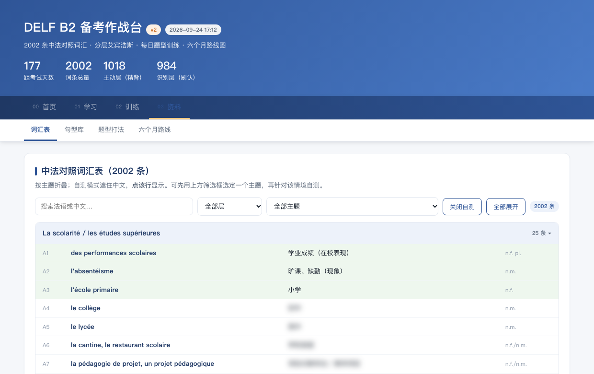
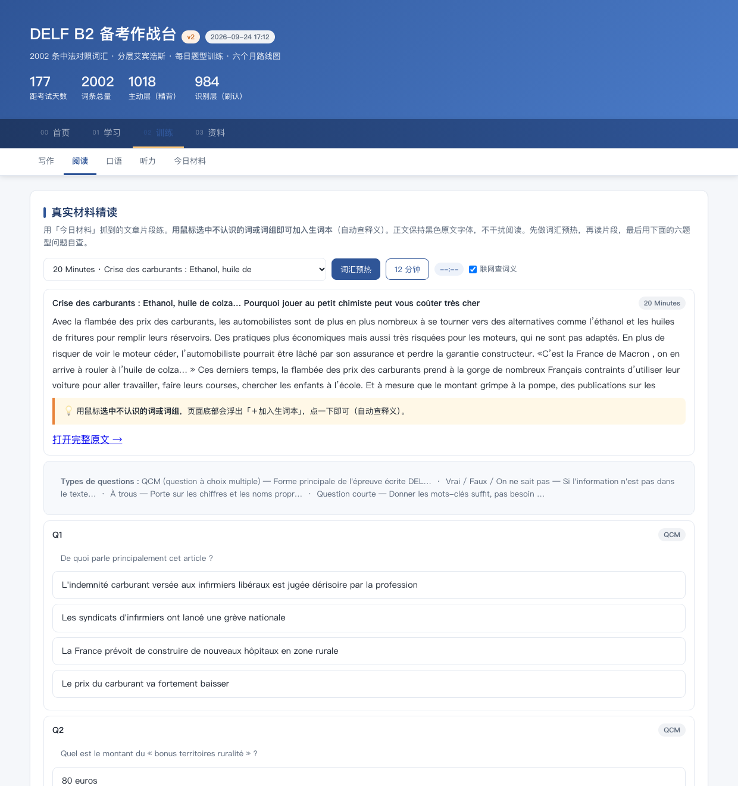
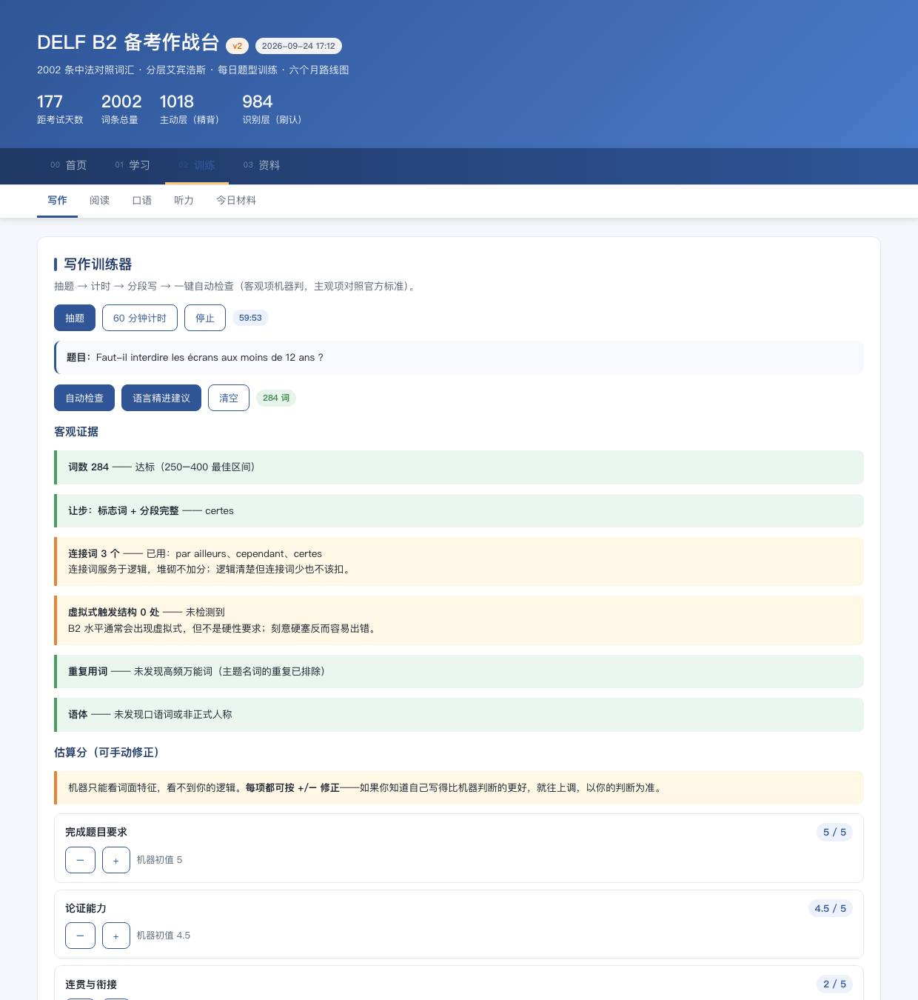
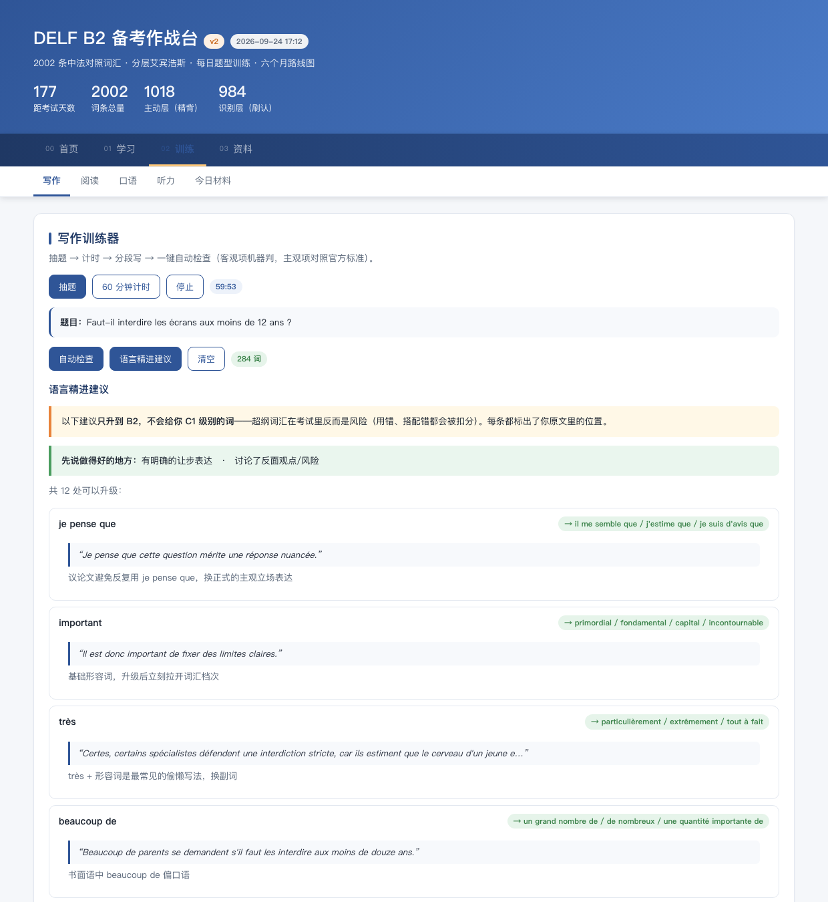
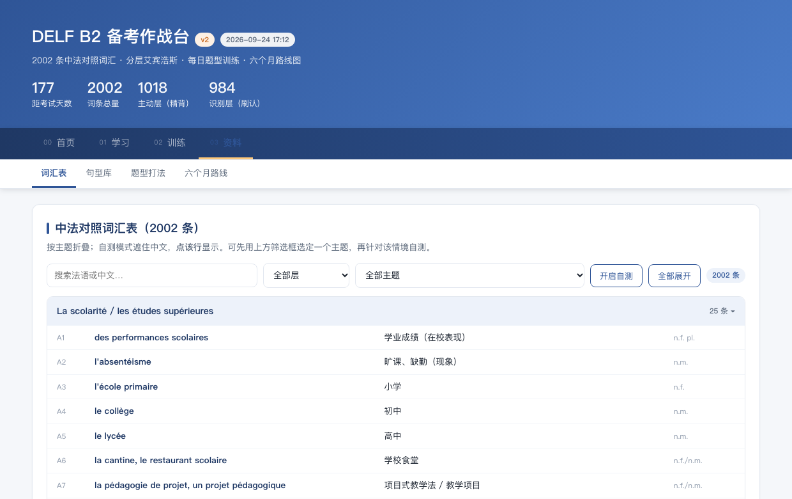

# How I AI

## Turning two vocabulary PDFs into a self-contained French study dashboard (with an AI coding assistant in VS Code)

**Name:** XU Shiqi  
**Student number:** 3036761155  
**AI tool:** AI coding assistant in VS Code

## 1. What I use AI for

I am preparing for the DELF B2 French exam about six months from now, and what I needed was a study **tool**, not a document. So I asked an AI coding assistant in VS Code to help me build **one self-contained web page** with six modules — a spaced-repetition plan plus today's task list; a home dashboard (countdown, workload curve, suggestions); a vocabulary list with a self-test mode; a daily reading/listening drill built from French news; a word-lookup bar with a personal wordbook; and automatically generated practice questions. §2 shows the **same loop** that produced all six of them, module by module.


I don't program, and doing this by hand in Excel would have been slow and error-prone (2,000 entries × a 180-day schedule). So I use the assistant to write a small **generator**: a Python program that turns my data into **one self-contained `.html` file**. My job is to give a precise specification and to check every output; the assistant's job is to write and revise the code.

This fits the assignment because it is a real, recurring need (I use the page every day) and, more importantly, because **the same small loop produced all six modules** — *write a precise spec → let the assistant generate the code → ask for a small test → fix what the test exposes*. That loop is what §2 explains, and it is reusable for any other study material.

## 2. How you can do it too

**What you need.** VS Code; Python 3.10+ (the build uses **only the standard library** — no `pip install`); Node.js only for the automated check below.

**Setup.** Open your project folder in VS Code, open Copilot Chat, and switch it to **Agent mode** so it can read/write files and run terminal commands for you.

**My reusable prompt (the "master prompt" I paste at the start of a session):**

```
You are my coding assistant inside VS Code. Work only inside this folder.
Goal: <one-sentence goal>.
Source material: <files in this folder>.
Hard rules:
1. Deliver ONE self-contained .html file: all CSS/JS inline, no CDN, no external files,
   so I can open it by double-click and publish it as-is.
2. Keep the source data in separate plain .py data files, so I can correct one word
   without touching the layout code.
3. Provide a build script. After every change, run it and report the output file size.
4. For every interactive feature, also write a tiny headless test and show me the
   pass/fail output. Do not tell me something is fixed until you have run it.
5. Never invent data. If a source cannot be fetched, leave it empty and say so.
Show me a short plan first; wait for my OK before writing code.
```

**The loop (input → steps → output):**

1. **Give it the raw material.** I put the two vocabulary PDFs in the folder and asked the assistant to convert them into two plain data files (`vocab_data.py`, `vocab_new.py`) — one line per entry: *French · Chinese · part of speech · theme*. (The PDF→text step is one-off; after that the PDFs are no longer needed.)
2. **Ask for the schedule model.** "Build a 180-day review plan that shows each entry three times, spread out, and never loads more than X entries onto one day." → `schedule.py`, pure date arithmetic.
3. **Ask for the generator.** "Write `build_dashboard.py` that reads those data files and writes ONE HTML file with inline CSS/JS, containing the six modules listed in §1."
4. **Run it** in the VS Code terminal: `python build_dashboard.py`. It prints where it wrote the file plus a one-line summary, e.g. `主动层 1018 | 识别层 984 | 合计 2002`.
5. **Open the HTML** (double-click) and actually use it.
6. **Iterate by reporting what I *see*, not by asking to "fix the app".** For example: *"When I click 开启自测 the table collapses into thin vertical bars — I can't see any words."* Vague requests produce vague fixes; a concrete symptom produces a concrete fix.
7. **Automate the daily part.** A short `refresh.sh` runs the fetch script, rebuilds the page, and copies the result (fetch → build → copy). A scheduled task runs it each morning, so the reading and listening material is new every day without me doing anything.

**The same loop, applied to each of the six modules.** This is the part I would want another person to copy — not the code, but the fact that one loop, repeated, produced the whole tool:

| Module                    | The spec I gave (one line)                                                            | How I checked it                                                                            |
| ------------------------- | ------------------------------------------------------------------------------------- | ------------------------------------------------------------------------------------------- |
| Spaced-repetition plan    | "180 days, each word three times, no day overloaded."                                 | Printed the plan: every word appears 3×, and no day exceeds the cap.                        |
| Dashboard                 | "Show today's task, the 180-day workload curve, and three suggestions."               | Compared the streak and accuracy numbers with my own log for a few days.                    |
| Vocabulary self-test      | "Hide the Chinese meaning; click a row to reveal it."                                 | Clicked rows in the built page and ran a test asserting the toggle works.                   |
| Daily reading & listening | "Fetch today's French news and a podcast transcript; show the full text in the page." | Compared the saved text with the source page; a failed fetch stays empty — never fake data. |
| Word lookup               | "Select a word → show its part of speech and Chinese meaning; save both together."    | This is the one example I expand on in §3.                                                  |
| Generated questions       | "Make practice questions from today's article."                                       | Answered them myself and checked each auto-answer against the text.                         |

A few of those modules, as they actually look:

**Vocabulary self-test** — the Chinese meaning is hidden; clicking a row reveals it (green = revealed):



**Daily reading + generated questions** — today's article (full text in the page) followed by questions made from the article:



**Writing: automatic check** — I paste a ~280-word essay and the app reports objective evidence plus an editable score estimate:



**Writing: language-upgrade suggestions** — the same essay, with concrete B2-level upgrades and the sentence from my own text:



There is no framework. The whole "build" is data in → one string → file out:

```python
# build_dashboard.py — the abridged core (no framework: data in -> one string -> file out)
from vocab_data import VOCAB          # two plain data modules (one line per entry)
from vocab_new  import NEW_VOCAB
import json
# ... compute the entries + the 180-day plan into one dict called DATA ...
HTML = TEMPLATE                       # one big placeholder template, inline in this same file
HTML = HTML.replace("__DATA__", json.dumps(DATA, ensure_ascii=False))
open("index.html", "w", encoding="utf-8").write(HTML)
print("saved: index.html")
```

**Output.** A single `index.html` (~500 KB, everything inline) plus a few `.py` files. Mine is published as a static page here: `https://1557302476-alt.github.io/DELF_B2_preparation/`

## 3. One example of using it

**My input:**

> In the reading module I want to look a word up without leaving the page. When I select a French word (or a short phrase) in the article, a bar at the bottom should show its **part of speech and a Chinese meaning**. When I click 加入生词本 it should save the word *together with* that meaning and part of speech.

**AI output:** (excerpt) It added a text-selection listener plus a fixed bar at the bottom of the window; a lookup that tries my own word list first and an online dictionary for anything missing; and a save path that stores `{word, meaning, pos}`. In use the bar shows e.g. `flambée · n.f./v. · 暴涨`, and saving stores `{"cn":"暴涨","p":"n.f./v."}`.


**My check:**

1. **By hand.** I selected six words whose meaning I already knew and compared. The gender matched every time (`prix` → n.m., `maison` → n.f., `livre` → n.m., `flambée` → n.f.).
2. **Automated, before/after.** I asked for a headless test that looks up six words in a row and prints each result. It immediately exposed a real problem:

```
# BEFORE
dérisoire -> 可笑 | inédit -> 新奇 | prévisible -> 可预见的
surprenant -> (empty) | flambée -> (empty) | chômage -> (empty)        # 3 / 6
```

After the fix described in §4:

```
dérisoire -> 可笑 | inédit -> 新奇 | prévisible -> 可预见的
surprenant -> 奇怪 | flambée -> 暴涨 | chômage -> 失业               # 6 / 6
```

## 4. What went wrong, and what I changed

**The error.** Some words came back with *no meaning at all* — and it looked random, because the **same word worked again a minute later**.

**How I noticed.** I re-looked-up a word that had just failed and it worked the second time. So it wasn't "the dictionary doesn't know this word". I then ran the *same* six lookups two ways:

```
6 lookups in a row        -> 3 succeeded, 3 empty
6 lookups, 2s apart       -> 6 succeeded
```

That made the cause obvious: the free public dictionary endpoint **rate-limits** you if you hit it too quickly. "Empty" meant *"slow down"*, not *"not found"*.

**What I changed.**


1. **Queue the requests** and space them out (a minimum gap between calls) instead of firing them in parallel, and drop queued requests for words I have already scrolled past.
2. **One automatic retry** after a short delay when a result comes back empty.
3. **Only cache a result when it actually returned a meaning** — so a failed lookup is retried next time instead of being remembered as "empty".

Result: 6/6 even when I look words up quickly. The reusable lesson: **"empty result" is not the same as "not found"** — separate a genuine miss from a transient/rate-limit failure, and prove which one it is by repeating the query.

**A second error, of the same family — a name collision in the styling.** When I turned on the vocabulary self-test, the whole list collapsed into thin vertical bars:




The cause was that the class name I had used for the self-test was the *same* name already used to style the small "badge" chips in the page header, so switching the self-test on also applied `display:flex` to the entire list. The fix was to give the self-test its own class name. I now have the assistant put a one-line "are all `id`s unique, and is any class name reused?" check into the test harness — it is cheap, and that same check had already caught an earlier bug where two elements shared one `id` and a countdown printed its digits into the wrong block.
